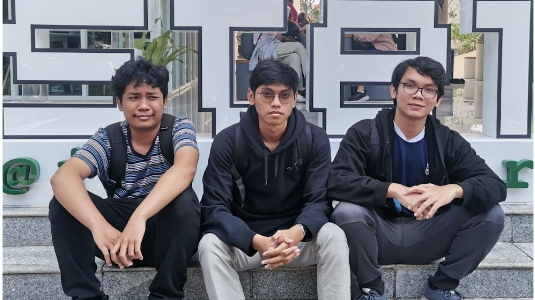

# Algeo01-22129
| NIM | Nama |
| :---: | :---: |
| 13522129 | Hugo Sabam Augusto |
| 13522136 | Muhammad Zaki |
| 13522138 | Andi Marihot Sitorus |

Berakit-rakit kehulu
Berenang-renang ke tepian
Kalau ada pinjam seratus dulu
Nanti aku bayar kemudian

## Deskripsi Program
 - Program ini dapat menyelesaikan Sistem Persamaan Linier (SPL) dengan metode :    Gauss, Gauss-Jordan, Matriks Balikan dan Metode Cramer
 - Program ini dapat mencari determinan dari suatu Matriks dengan metode : Operasi Reduksi Baris(OBE) dan Kofaktor
 - Program ini dapat mencari matriks balikan dengan metode : Gauss-Jordan dan Adjoin/Kofaktor
 - Program ini dapat menyelesaikan permasalahan Interpolasi Polinom
 - Program ini dapat menyelesaikan permasalahan Interpolasi Bicubic Spline
 - Program ini dapat menyelesaikan permasalahan Regresi Linier Berganda
 - Program ini bisa melakukan pembesaran size gambar dengan Bicubic Spline.

## Cara run program
1. Clone git repo ini
2. pindah ke folder bin `cd bin`
3. di dalam folder bin , untuk run program `java mainprogram`

## Foto

